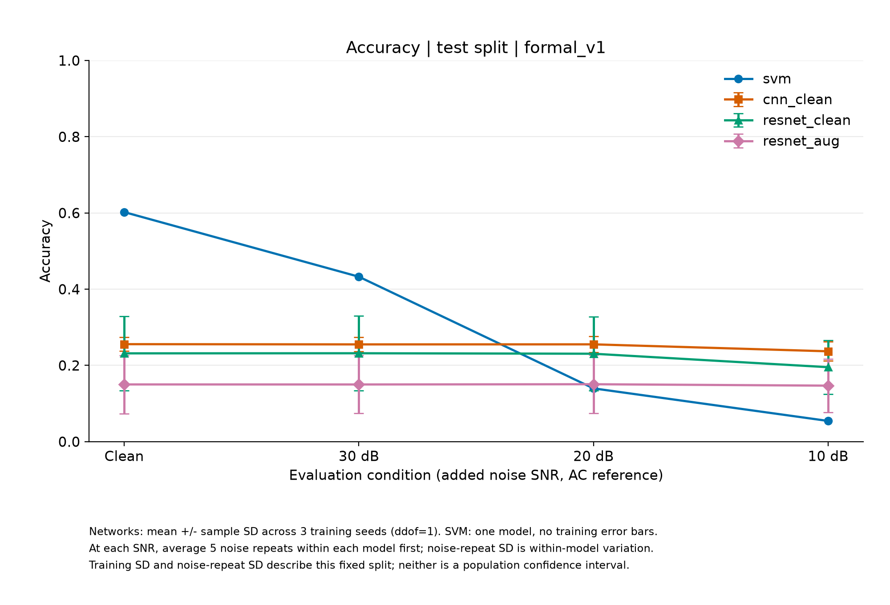
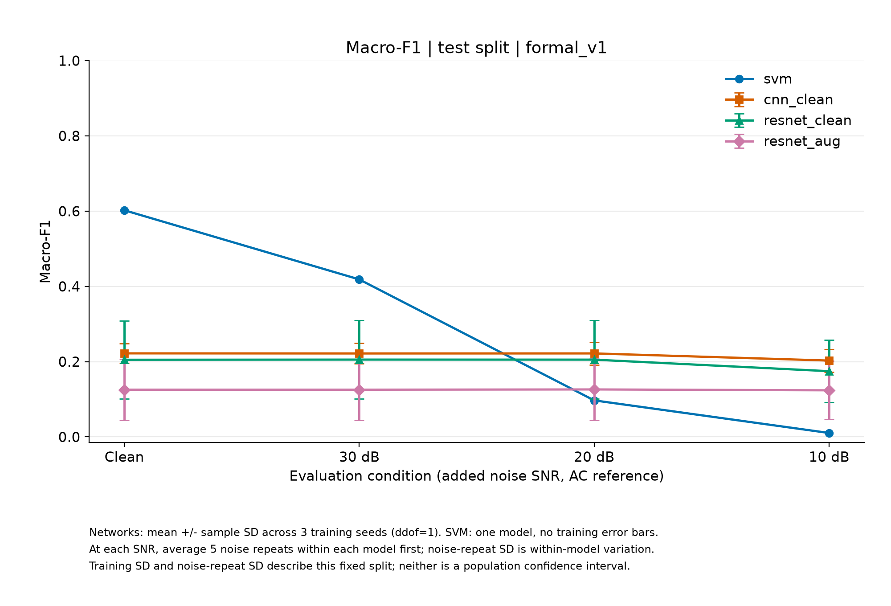
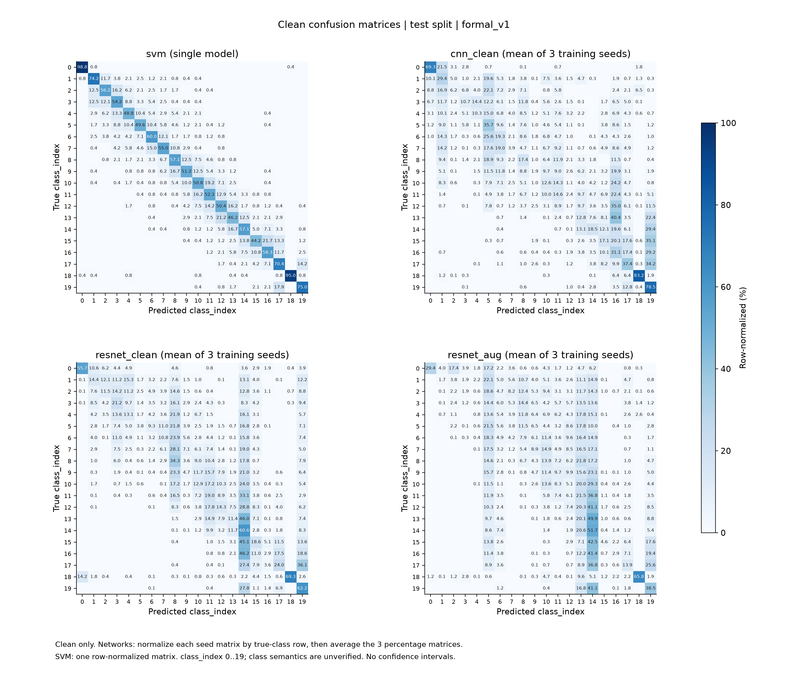

# formal_v1正式评价结果

2026-10-02。固定九个深度模型和单个SVM已完成全部validation/test评价，训练及模型选择保持2026-10-01登记配置，测试分数没有用于调参。类别语义未确认，所有数字为20个class_index的离散分类结果。

## 测试集准确率

grouped_v1测试4800条，每类240条，三个名义连接组0/4/9各1600条。Clean每模型一次，30/20/10dB各noise100–104五次；深度模型先在每训练seed内平均噪声重复，再汇总seed0/1/2。表中±为三个训练seed均值的样本标准差，单位为百分点；SVM是一个确定性模型，表中不伪造训练seed方差。

| 模型/流程 | Clean | 30 dB | 20 dB | 10 dB |
|---|---:|---:|---:|---:|
| SVM | 60.23% | 43.28% | 13.98% | 5.43% |
| CNN clean | 25.58% ± 1.79 | 25.52% ± 1.86 | 25.53% ± 2.12 | 23.71% ± 2.54 |
| ResNet clean | 23.17% ± 9.76 | 23.19% ± 9.77 | 23.07% ± 9.69 | 19.53% ± 7.06 |
| ResNet增强 | 15.01% ± 7.63 | 15.00% ± 7.61 | 15.07% ± 7.65 | 14.69% ± 6.98 |

SVM噪声重复的Accuracy样本SD为30dB 0.160、20dB 0.352、10dB 0.017个百分点。这是固定模型的扰动波动，与网络三训练seed的波动不是同一种统计量；网络内部噪声SD在summary.json中单列。所有SD均不是实际采集总体置信区间。



## 测试集Macro-F1

| 模型/流程 | Clean | 30 dB | 20 dB | 10 dB |
|---|---:|---:|---:|---:|
| SVM | 0.6023 | 0.4185 | 0.0971 | 0.0104 |
| CNN clean | 0.2220 ± 0.0266 | 0.2217 ± 0.0273 | 0.2218 ± 0.0301 | 0.2029 ± 0.0301 |
| ResNet clean | 0.2050 ± 0.1040 | 0.2054 ± 0.1041 | 0.2053 ± 0.1042 | 0.1746 ± 0.0831 |
| ResNet增强 | 0.1255 ± 0.0815 | 0.1255 ± 0.0813 | 0.1261 ± 0.0819 | 0.1238 ± 0.0775 |



Clean名义连接组Accuracy如下。深度模型为三训练seed均值；这是连接组，不直接称为三位独立采集人员。

| 模型/流程 | group 0 | group 4 | group 9 |
|---|---:|---:|---:|
| SVM | 58.88% | 60.88% | 60.94% |
| CNN clean | 25.67% | 25.23% | 25.83% |
| ResNet clean | 22.40% | 23.31% | 23.79% |
| ResNet增强 | 14.73% | 14.90% | 15.42% |

完整每类指标/混淆矩阵及各条件每组表现保存在[测试报告](../results/evaluation/test_v1/report.json)，分层统计见[测试汇总](../results/evaluation/test_v1/summary.json)。validation noise10–14已完整执行，见[验证汇总](../results/evaluation/validation_v1/summary.json)，不混为测试种子结果。



图仅按类别索引排列。网络混淆矩阵为各训练seed先按真实类别行归一，再平均百分比；不将相邻索引解释为相邻毫米深度。PNG/SVG和图provenance均保存，可用scripts/plot_evaluation.py从完成的评价目录复绘，新输出目录拒绝覆盖。

## 可以回答的研究问题

在当前固定数据/训练设置下，统计几何特征SVM的干净分类表现高于简化时序网络；附加噪声会改变相对表现，20/10dB下CNN/普通ResNet平均准确率高于SVM。CNN在10dB相对Clean下降约1.87个百分点，SVM下降约54.80个百分点。网络较小的性能下降应结合其较低的干净基线解释，不能仅以相对下降宣布全面更好。

本轮增强ResNet在所有条件下的平均指标低于普通ResNet，没有观察到增强流程优势。其训练损失下降但验证曲线波动较大，机制尚未确定；训练噪声和epoch选择目标同时变化，不作单因素因果结论。保留较差seed和早停结果，不据测试成绩修改网络。后续如诊断学习行为，可使用train/validation另立探索性协议；最终测试已见，新增模型不能再被描述为本轮未见测试的确认性实验。

## 实现与结果验收

新增评价器在真实GPU环境147项回归全部通过，独立审查发现并复查三项边界修复；冻结训练/模型/噪声源码、registry和九配置没有修改。先完成validation512000条预测与独立验收，再保存[test释放记录](../results/evaluation/test_release_v1.json)，执行一次冻结test评价768000条预测。每集合共160份总体指标，validation320/test480份连接组指标；全部权重/SVM Pipeline重载逐条复算一致，CSV独立计数和NumPy分层统计最大差异5.55e-17。

两集合各15份共享噪声信号SHA匹配，零AC不适用样本数均为0，实际残差SNR最大误差validation3.21e-11/test4.78e-11dB。验收详见[validation acceptance](../results/evaluation/validation_v1/acceptance.json)和[test verification](../results/evaluation/test_v1/verification.json)，包含独立核验脚本全文/SHA；评价报告绑定实际执行源码及相同模型权重/数据身份。

## 适用边界与复现

噪声是基于降采样原单位联合AC功率的有限长度高斯抽样，经逐通道去均值和能量校准；保留直流，随后使用既定训练标准化/特征Scaler。不能把10dB解释为相对总直流功率，也不能替代真实仪器干扰、提离变化或所有现场噪声。

结果仅限同一试件、当前公开数据和整组去重/指定近重复距离的协议。原发布train/test重叠、实际来源独立性及未排查变换的限制见[数据审计](data_audit_report.md)。本项目网络、预处理及划分均与原论文不同，不直接比较为严格复现。未报告毫米误差或具名Normal/Lift-off指标。

逐条预测CSV本地保留，公开仓库以predictions.csv.gz发布以减小结果文件体积；compression.json记录原始CSV SHA、压缩文件SHA及逐字节还原验证。解压后SHA必须等于report.json的predictions.csv条目，命令如下（默认拒绝覆盖已有CSV）：

```bash
gzip -dk results/evaluation/validation_v1/predictions.csv.gz
gzip -dk results/evaluation/test_v1/predictions.csv.gz
```

原始NPY、缓存、权重/环境不提交Git；生成权重需按已登记配置复跑。本地评价命令见[评价协议](repeated_evaluation.md)。registry的test_classification_evaluated=false是登记时的历史状态，不改写冻结文件；最新运行状态另记execution_status.json。
