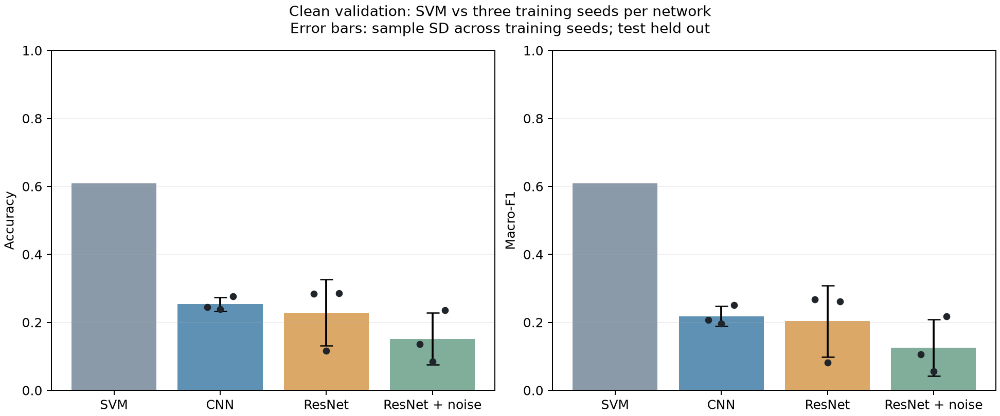
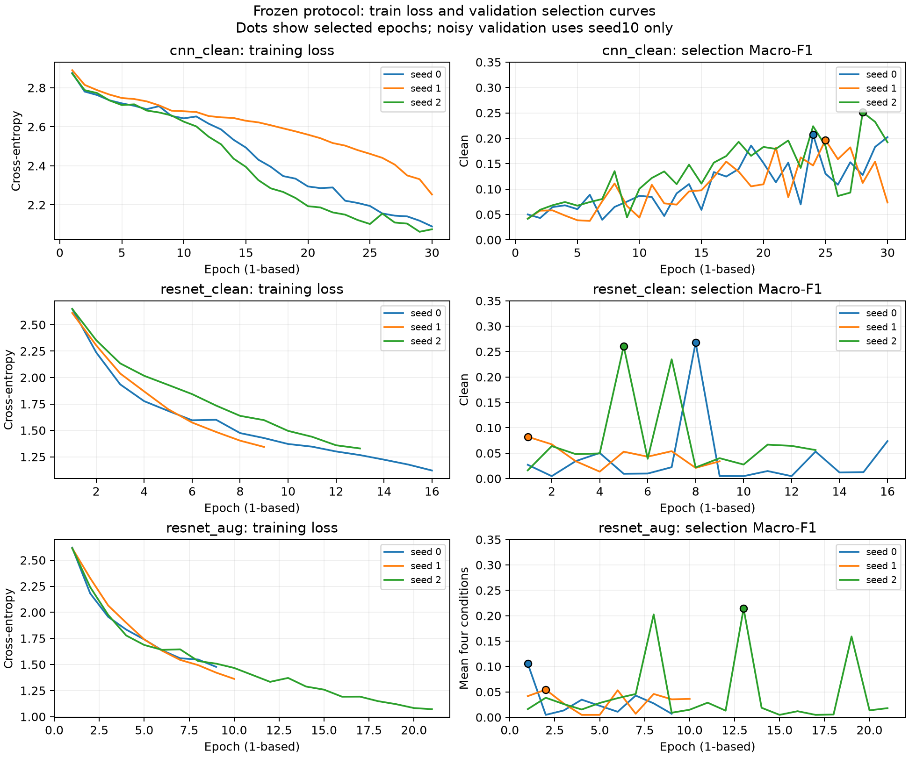

# formal_v1完整训练与验证结果

2026-10-01。九项冻结配置全部完成：24000条训练、3200条验证，CNN clean、ResNet clean、ResNet增强各训练seed0/1/2。默认auto均实际使用RTX5070Ti，模型与数据代码保持登记时的版本。最终test分类尚未执行。

## 干净验证结果

| 模型/流程 | Accuracy | Macro-F1 |
|---|---:|---:|
| SVM（冻结九候选选出RBF C10、gamma0.1） | 60.91% | 0.6086 |
| CNN clean | 25.33% ± 2.01个百分点 | 0.2182 ± 0.0290 |
| ResNet clean | 22.84% ± 9.77个百分点 | 0.2036 ± 0.1051 |
| ResNet增强 | 15.18% ± 7.66个百分点 | 0.1258 ± 0.0828 |

深度模型为三个训练seed的均值±样本标准差，SVM为单个确定性选择结果；不是采集总体置信区间。所有模型使用同一grouped_v1。CNN/普通ResNet按干净验证Macro-F1选择epoch；增强ResNet按四条件验证Macro-F1平均值选择，不能将两流程差异全部归因于训练噪声。

## 每项运行与选择

| 运行 | 执行epoch数 | 选中epoch（从1计） | Clean Accuracy | Clean Macro-F1 |
|---|---:|---:|---:|---:|
| cnn_clean_s0 | 30 | 24 | 24.53% | 0.2070 |
| cnn_clean_s1 | 30 | 25 | 23.84% | 0.1965 |
| cnn_clean_s2 | 30 | 28 | 27.63% | 0.2512 |
| resnet_clean_s0 | 16 | 8 | 28.47% | 0.2678 |
| resnet_clean_s1 | 9 | 1 | 11.56% | 0.0823 |
| resnet_clean_s2 | 13 | 5 | 28.50% | 0.2607 |
| resnet_aug_s0 | 9 | 1 | 13.53% | 0.1052 |
| resnet_aug_s1 | 10 | 2 | 8.47% | 0.0552 |
| resnet_aug_s2 | 21 | 13 | 23.53% | 0.2168 |

报告selected_epoch从0计，本表及图从1计。ResNet按登记的patience8提前停止；未因验证得分临时延长训练、更改参数或丢弃较差seed。完整每epoch损失/四条件指标、每类和连接组指标保留在各report.json。

SVM在本轮干净验证上明显更高；当前冻结深度模型没有取得优势。训练损失降低而ResNet验证指标大幅波动，值得后续使用train/validation诊断学习行为与分布差异，当前不能仅凭曲线判定某一种原因。保留本轮作为完整对照，后续新模型/训练规则如有必要，应另立探索性协议，不能覆盖formal_v1。当前结果也不构成对端到端网络普遍有效性的结论。

## 权重、预测与设备验收

登记时间早于九项训练的created_utc，所有配置文件及resolved config SHA与登记一致。独立从保存权重进行真实GPU和CPU推理，各核对115200条验证预测（9×4×3200）；CSV的行序、wave_sha256、group_id、类别索引及noise seed均核对，直接计数重算混淆矩阵、每类指标及连接组指标，均匹配。

所有权重以CPU tensor保存，当前GPU→CPU迁移四条件分类差异均为0。logits最大绝对差为0.0001735687，部分运行未满足既定逐元素allclose容差，报告没有将其改成通过；权重可加载和当前分类一致不等于未来任意输入跨设备逐位一致。重放验证须先配置与训练相同的确定性/TF32开关，见seed_everything，不能只调用load_deep_model推断运行环境已设置。

验收记录：[training_verification.json](../results/experiments/formal_v1/training_verification.json)。包含验证脚本全文/SHA、九报告SHA与逐条件结果；原始NPY、缓存和权重留本地，公开仓库中的权重SHA用于追溯，正常clone需复跑才能取得权重。

另一次只读复核使用独立NumPy计数，115200行CSV、36份总体/72份组指标完全匹配，48000个原始来源身份重新哈希一致，九checkpoint元数据及注册源码SHA绑定通过，见[independent_review.json](../results/experiments/formal_v1/independent_review.json)。GPU验收脚本通过加载器核对报告与当前源码，未直接比较registry代码表；后者由该独立复核及发布前冻结SHA检查补齐，两部分共同构成完整证据。36个迁移条件中28个逐元素容差标志false，分类差均为0。

## 当前完成边界与后续

本轮四条件预测中的噪声只有epoch选择使用的seed10。汇总JSON/CSV明确标注该口径，不作为noise10–14重复实验，也不将Clean复制五次。验证noise10–14和正式test noise100–104已登记，尚未运行；下一单元先实现和验收固定重复评价与统计汇总，再执行一次正式test分类。test信号已经用于冻结距离的数据审计和完整文件身份检查，尚未用于分类评价或选参。

类别映射仍未确认，仅报告class_index，未计算毫米误差或具名Normal/Lift-off指标。来源独立性的限制见[数据审计](data_audit_report.md)及[测试侧近重复审计](test_similarity_audit.md)。

结果入口：[冻结登记](../results/experiments/formal_v1/registry.json)、[执行状态](../results/experiments/formal_v1/execution_status.json)、[汇总JSON](../results/experiments/formal_v1/training_summary.json)、[逐运行四条件CSV](../results/experiments/formal_v1/training_summary.csv)。汇总记录包含生成脚本及图/CSV SHA；PNG用于查看，SVG用于报告导出。
