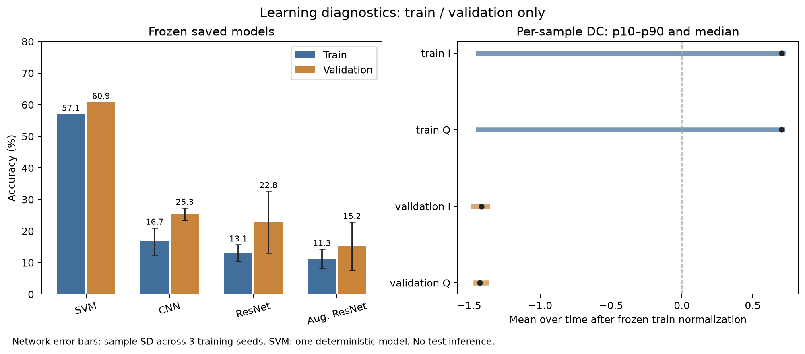
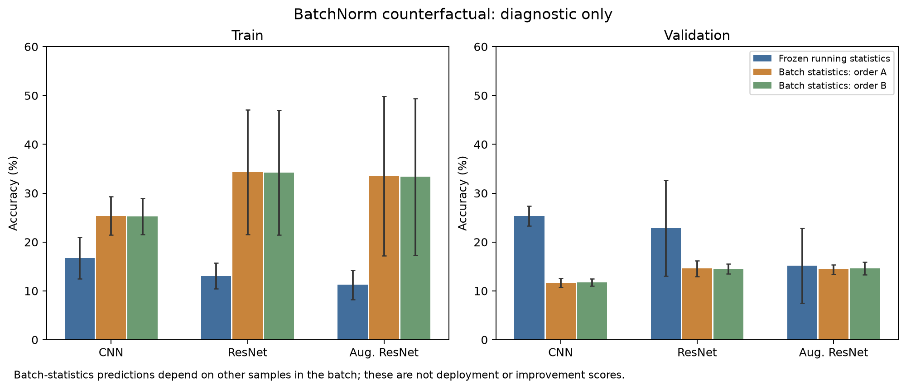

# formal_v1训练行为诊断

2026-10-02。仅使用train24000/validation3200，固定九个原权重与SVM，不更新参数、不改epoch、不推理test。当前登记权重是验证规则选中的epoch，以下训练集成绩不是最后epoch、也不是训练模式的在线准确率。

## 固定推理结果

网络为三训练seed均值，SVM为一个确定性模型。Accuracy单位百分比；训练和验证来自不同组，不能由表中差距直接判定过拟合/欠拟合。

| 模型 | Train Accuracy | Validation Accuracy | Train Macro-F1 | Validation Macro-F1 |
|---|---:|---:|---:|---:|
| SVM | 57.10% | 60.91% | 0.5706 | 0.6086 |
| CNN | 16.72% | 25.33% | 0.1448 | 0.2182 |
| ResNet | 13.06% | 22.84% | 0.1126 | 0.2036 |
| 增强ResNet | 11.26% | 15.18% | 0.0911 | 0.1258 |

网络对训练集的固定推理表现也很低，不能只讨论验证泛化；需要检查优化收敛、epoch选择、输入尺度及BN运行行为。保留这些实际结果，不用表现较好seed替换均值。

## 输入分布与尺度

训练逐通道标准化的mean约0、std约1，计算符合冻结协议。验证mean为[-1.41332,-1.41373]，std为[0.06110,0.05648]，分布明显不同。这是对现有train/validation缓存的观察，不证明实际人员身份或仪器变化原因。

训练标准化后样本DC的跨样本std为[0.999831,0.999864]。按全方差分解，样本间DC变化占逐通道总方差99.966%/99.973%；样本联合AC RMS中位仅0.002897。验证联合AC RMS中位0.014331。统一全局std缩放主要由DC变化决定，时序起伏相对很小；尚无受控训练证明它是低准确率的原因。每组输入mean/std补充在group_input_summary.json，不能将组直接称为独立人员。

后续可预登记“保留DC，同时对AC分量使用单独训练尺度”的诊断干预；不默认逐样本幅值归一化，以免丢失幅值信息。它只是候选，先验收论文方法基线，不把候选写成已证明的改进。

## BatchNorm反事实

克隆原模型，仅BN使用当前混合批统计，其余层eval，无梯度/运行统计更新；batch128，两个预先固定批序20261002/20261003。所有原模型state和文件未变。结果依赖同批其他样本，是传导式诊断，不是部署或泛化成绩。

| 模型 | Train固定 | Train批统计A/B | Validation固定 | Validation批统计A/B |
|---|---:|---:|---:|---:|
| CNN | 16.72% | 25.37% / 25.26% | 25.33% | 11.65% / 11.72% |
| ResNet | 13.06% | 34.27% / 34.21% | 22.84% | 14.58% / 14.54% |
| 增强ResNet | 11.26% | 33.52% / 33.35% | 15.18% | 14.40% / 14.64% |

训练表现改善而验证没有一致改善，说明BN统计方式与输入分布值得检查，不支持直接将验证阶段切换为批统计。它也不能单独确认BN是全部低分的根因。

## 核验与复现

6项必要回归通过，独立只读代码审查无可复现P1/P2；实际CUDA诊断761600条预测全部经独立脚本重载匹配，56总体/252组指标从CSV直接计数完全一致。固定验证结果与先前正式评价clean逐项一致，输入统计另行核算；原登记/源码/配置/深度及SVM文件身份核查通过。证据为[report](../results/diagnostics/frozen_learning_v1/report.json)、[verification](../results/diagnostics/frozen_learning_v1/verification.json)，后者含完整独立脚本/SHA。

运行：`.venv/bin/python scripts/diagnose_learning.py --device auto --output results/diagnostics/new_run`。已有输出拒绝覆盖。读取器仍对三缓存哈希/mmap作身份检查，分类只用train/validation。公开预测gzip33552500字节，本地原CSV104507940字节；compression.json核验逐字节还原一致。公开clone可用`gzip -dk results/diagnostics/frozen_learning_v1/predictions.csv.gz`还原。

论文ResNeXt1D-38/裁剪组件已通过[学习与设备验收](paper_components_acceptance.md)，下一步按新登记实现训练器并训练可比较基线；现有结果不构成原方法复现，更不构成新方法提升证据。
