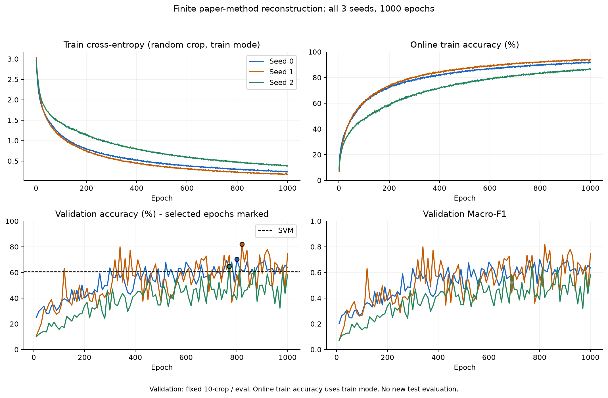
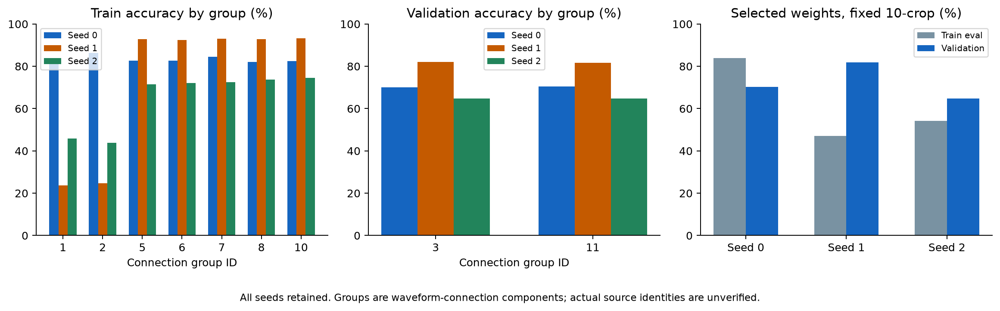
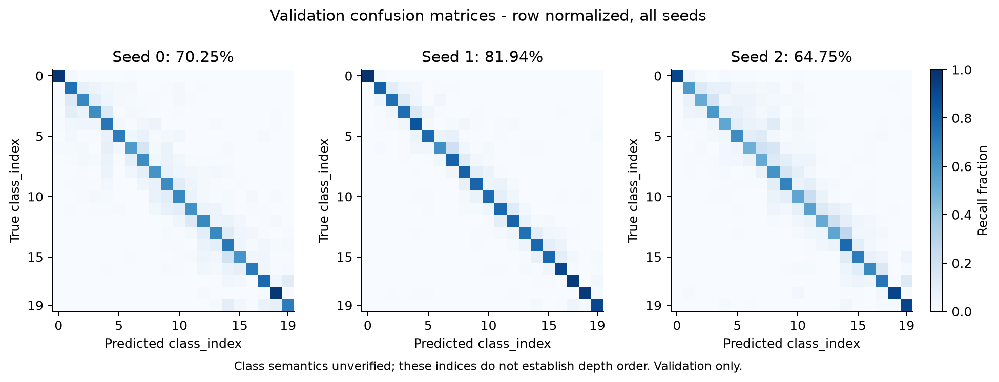

# 1000轮论文方法重建：完整结果与诊断

2026-10-03。三个seed均完成全量24000条train、3200条validation的1000轮训练，按原登记规则选择权重，并各完成独立CUDA重载核验。完整训练及核验于北京时间2026-10-03 03:57:43结束，没有执行新的test分类评价。

原执行registry/config/绑定源码未改写。逐轮报告在results/experiments/paper_baseline_v1/resnext_s0–s2/，独立核验在verification/，[精确汇总与脚本全文](../results/experiments/paper_baseline_v1/analysis_results_v1/summary.json)保存输入/输出SHA及全部seed。分析对应[先前记录的五项问题](paper_baseline_1000_questions.md)，是早期验证已见后补充的探索性分析。

## 完整模型成绩与实际时长

下表是选中权重的固定seed10、十crop、eval模式成绩；并非第1000轮的在线train Accuracy。权重按最高validation Accuracy、并列较早轮次选择，Macro-F1不改变选择。

| seed | 选中轮次 | Train Accuracy | Validation Accuracy | Validation Macro-F1 | 1000轮及最终评估耗时 |
|---|---:|---:|---:|---:|---:|
| 0 | 800 | 83.98% | 70.25% | 0.7035 | 2小时40分32秒 |
| 1 | 820 | 47.05% | 81.94% | 0.8192 | 1小时54分12秒 |
| 2 | 770 | 54.18% | 64.75% | 0.6481 | 1小时54分29秒 |

三seed validation Accuracy均值72.3125%，样本SD8.7774个百分点；Macro-F1均值0.723609，样本SD0.087307。全部seed保留，最佳/最差差17.1875个百分点，不能只选seed1的81.94%作为整体结果。三种子样本SD不是置信区间，也不能替代独立数据重复。

本次运行环境为RTX5070Ti、PyTorch2.9.1+cu128、确定性运算、TF32关闭、batch128。每个完整run耗时包含每10轮验证和最终选中权重评估/保存重载；后续独立核验另需约9.2–9.4秒。三个run累计训练/评估6小时29分12秒，整个顺序链含进程启动/核验共6小时29分56秒。首个run更慢，记录没有机器负载信息，不能确定原因；以上是本轮实测，不是其他设备或10000轮运行的承诺。

## Q1：模型确实持续学习，验证表现仍有明显波动

| seed | 首100轮平均loss → 末100轮 | 首100轮在线Accuracy → 末100轮 | 首10个验证点平均Accuracy → 末10个 |
|---|---|---|---|
| 0 | 1.5986 → 0.2509 | 45.19% → 91.37% | 30.86% → 63.33% |
| 1 | 1.5919 → 0.1855 | 44.98% → 93.54% | 26.98% → 65.09% |
| 2 | 1.7906 → 0.4022 | 36.87% → 85.80% | 15.64% → 48.03% |

训练loss持续下降、在线Accuracy上升，说明全量训练已经学到可用于分类的信息。学习曲线末段仍在变化，没有证据证明1000轮充分收敛。验证曲线起伏明显：末10个验证点Accuracy范围分别为58.625–69.594%、46.719–77.906%、32.219–59.750%。第1000轮validation分别63.8125%、74.65625%、58.3125%，均低于各自选中权重。

本轮没有触发原文5000/7500轮衰减，不能由上述曲线推断原10000轮最终成绩，或保证延长训练就能解决验证波动。

## Q2与Q4：连接组差异和种子稳定性值得进一步研究

同种eval/十crop推理下，Train减Validation Accuracy分别为+13.73、−34.89、−10.58个百分点。seed1的整体train只有47.05%，但train连接组5/6/7/8/10各组92.44–93.31%，组1/2分别23.63%/24.63%。这两个大组各有8000条，占全部train的三分之二，使整体train读数显著下降。seed2也存在大组与其他train组之间的差异；seed0各train组相对均衡。

既有输入诊断已发现大组1/2与其他train/validation组的DC统计差异，当前结果提供继续研究输入分布及BN推理行为的线索，但没有受控干预证据确定原因。在线train Accuracy与上述eval成绩使用不同模式和裁剪，不能直接相减作泛化差距，也不能由这些差异简单断言欠拟合或过拟合。

validation两个组的结果如下；每个seed内差不超过0.5个百分点，当前提升并非仅由其中一个验证组贡献。

| seed | Validation组3 Accuracy | Validation组11 Accuracy |
|---|---:|---:|
| 0 | 70.00% | 70.50% |
| 1 | 82.125% | 81.75% |
| 2 | 64.75% | 64.75% |

三个seed的20个validation类别均没有零Recall类别，但每类表现仍不同，详见per_class.csv及下图。类别名称与深度顺序仍未确认，混淆矩阵中的相邻索引不能解释为相邻深度。连接组也不等同已确认的实际采集人员。

## Q3：验证表现明显优于此前流程，尚不是受控创新效果

| 既有对照 | Clean validation Accuracy | 新方法三seed均值减该对照 |
|---|---:|---:|
| SVM | 60.90625% | +11.40625个百分点 |
| 简化CNN（三seed均值） | 25.33333% | +46.97917个百分点 |
| 普通ResNet（三seed均值） | 22.84375% | +49.46875个百分点 |
| 增强ResNet（三seed均值） | 15.17708% | +57.13542个百分点 |

与SVM相比，三个新seed均更高，最低seed仍高3.84375个百分点；平均Macro-F1提升0.114966。由此可明确：此前简化深度流程的低分不能代表重建论文方法在该划分下的表现。网络、裁剪、优化设置、训练预算和选择规则同时有差异，不能把本次变化归因于某一个组件，更不能把基线重建当本组已验证的创新方法。SVM也是AI，本轮不回答AI相对非AI是否提升。

所有比较均来自既有clean validation汇总及本轮相同validation集合。原论文93.58%是不同实验协议下的参考，不能直接作公平的提升/退步结论。本轮也没有验证新方法的噪声鲁棒性或最终test表现。

## Q5：完整结果可独立复算

三个seed各核验train24000/validation3200条，合计81600条；保存权重的独立十crop重载预测与CSV全部一致，全部总体/每类/连接组指标误差0。核验器独立实现裁剪、标准化和统计，没有调用训练器的预测接口。汇总进一步重核73份绑定文件的SHA，包括登记、原设计/验收、数据、权重、行表、预测、源码和核验记录。

结果整理时全项目264项回归在真实CUDA环境再次通过（51.253秒，无跳过）；PNG/SVG图已目视检查。该验收证明结果链可信，不能代替泛化或因果结论。

下一项实验应围绕验证波动与连接组差异建立受控对照；若补齐原10000轮预算，则另立配置/执行登记，保留原衰减和全部seed。当前没有启动新训练、重用已见test挑方案或改写旧结果。
