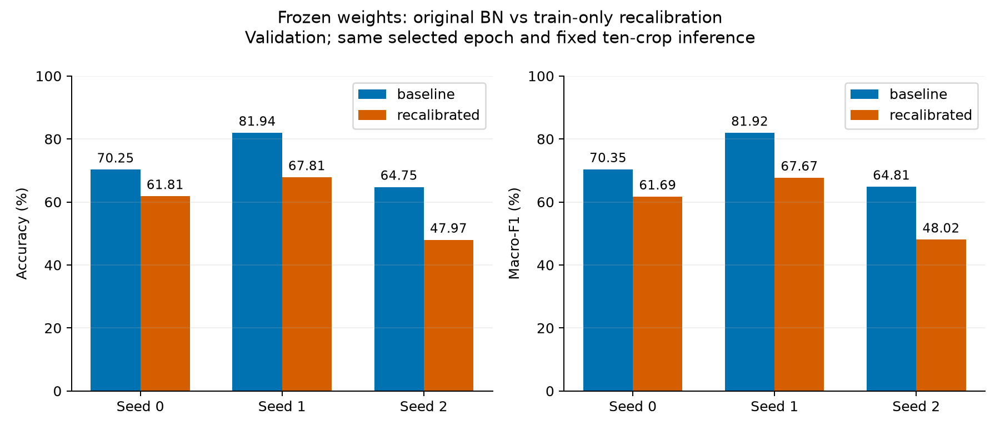
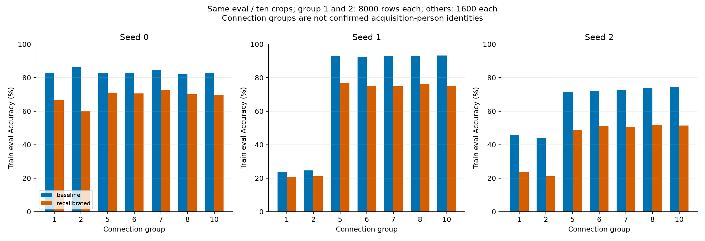

# E1：固定论文权重的BN重校准结果

2026-10-03。三个完整模型均完成指定的一次train-only BN重校准及独立CUDA回放/预测核验。**本次重校准未改善分类，三个seed的train和validation均下降；后续保留原模型作为基线，不采用这项后处理。**

对应[已确定的受控设计E1](plans/2026-10-03-controlled-followup.md)及[实现/复跑协议](paper_bn_recalibration.md)。新的执行registry在全量干预前冻结，SHA256 `a01ad2d6c0e8e2d9bc40b6bd1391f0b16cfa54c582533b19334d641e6589adeb`；执行源码检查点a619000。旧13源码、原权重/登记/已核验成绩未改写，所有新结果为探索性train/validation分析，没有新test分类。

## 配对验证结果

原选中epoch为800/820/770，不重新选权重。模型参数包括BN仿射参数逐值不变；仅复制后更新运行统计。三个模型使用相同24000条train、manifest全序、seed0/epoch0单224裁剪、batch128、单遍188批（末批64），重置后累计批统计，再切eval。前后评价均为固定seed10十crop平均概率。

| Seed | 原Validation Accuracy | 校准后 | 变化（百分点） | 原Macro-F1 | 校准后Macro-F1 |
|---|---:|---:|---:|---:|---:|
| 0 | 70.25% | 61.8125% | −8.4375 | 0.703465 | 0.616854 |
| 1 | 81.9375% | 67.8125% | −14.1250 | 0.819227 | 0.676733 |
| 2 | 64.75% | 47.96875% | −16.78125 | 0.648135 | 0.480200 |
| 三seed均值 | 72.3125% | 59.19792% | −13.11458 | 0.723609 | 0.591262 |

validation Accuracy样本SD从8.7774升至10.1770个百分点，最差seed从64.75%降至47.96875%；没有验证稳定性收益。Macro-F1均值下降0.132347。样本SD只描述三个训练种子在固定划分下的差异，不是置信区间。



## 训练与连接组结果

| Seed | 原Train eval Accuracy | 校准后 |
|---|---:|---:|
| 0 | 83.98333% | 65.96667% |
| 1 | 47.05% | 39.1625% |
| 2 | 54.175% | 31.86667% |
| 三seed均值 | 61.73611% | 45.66528% |

三个seed的七个train组都下降。seed1的大组1/2合并Accuracy从24.125%降至20.925%，其余组从92.9%降至75.6375%。虽然“大组减其他组”的差距从−68.775缩至−54.7125个百分点，两边成绩都降低，不能将差距缩小当成分类改善。完整组/类别结果保存在groups.csv/per_class.csv；组是连接分量，不代表已确认的实际采集人员。



## 实验核验与边界

三个模型合计校准72000条train；新增81600条train/validation预测全部独立重载一致。核验器手工实现训练裁剪、标准化和BN回放，同设备所有BN缓冲逐值一致；非BN状态及全部可学习参数逐值不变。总体/每类/每组混淆矩阵与指标独立直算误差0。原模型文件SHA保持不变。

终版实现验收309项真实CUDA回归65.438秒无跳过通过，CPU/CUDA40/40及CUDA产物CPU迁移240条预测核验一致；这些小规模成绩仅证明实现/设备路径。完整生产执行各12.26/12.08/12.25秒（含校准、固定十crop评价及身份检查），独立核验各12.12/11.79/12.03秒；顺序链总耗时83.54秒。耗时仅为此次实测。

[精确汇总](../results/experiments/paper_bn_recalibration_v1/analysis_results_v1/summary.json)保存配对均值/样本SD、全部seed和组差异、124份输入SHA、汇总脚本全文/SHA及PNG/SVG输出SHA。训练和独立核验的实际状态见execution_status.json及verification/；结果复核完成状态另见results_acceptance_v1/。

此干预证实指定运行统计变化影响推理表现，但只支持“这一固定校准规则不适用”。它没有确定原组差异的物理原因，也没有证明所有BN方案无效。累计批方差不是精确全体总体方差；校准使用固定epoch0裁剪，而原统计来自训练过程中随epoch变化的裁剪/批序，两者定义不同，当前没有分离这些因素的因果证据。

原1000轮方法重建的validation均值72.3125%仍有效。后续E2使用相同网络/初始化/1000轮/选择规则，只改变保留DC的DC/AC尺度处理，重新训练三seed作受控比较；BN后处理保留为设计中的消融列，不作为当前推荐模型。10000轮原预算基线及同预算改进、固定噪声验证仍待后续单元，旧test不用于选方案。

## 公开预测与还原

新完整预测以train_predictions.csv.gz、validation_predictions.csv.gz发布，原CSV本地保留但忽略Git；每run的compression.json绑定原CSV/压缩文件SHA与逐字节还原证据。公开clone核验前先还原（默认拒绝覆盖）：

```bash
gzip -dk results/experiments/paper_bn_recalibration_v1/resnext_s0/train_predictions.csv.gz
gzip -dk results/experiments/paper_bn_recalibration_v1/resnext_s0/validation_predictions.csv.gz
```

其余seed同样还原，原始NPY、参考资料、环境与权重不提交代码仓库。
