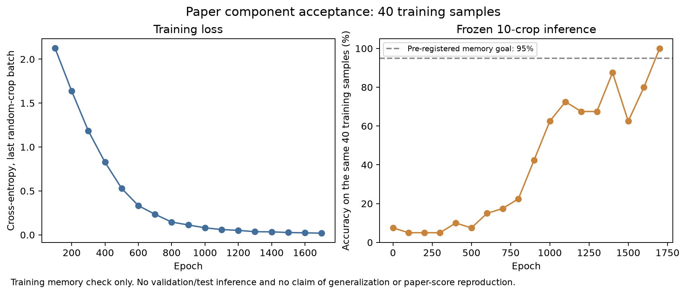

# 论文组件学习与设备验收

2026-10-02。新ResNeXt1D-38与224随机裁剪/10-crop组件已完成结构测试、独立审查及真实CUDA学习/CPU重载。结构和假设见[重建说明](paper_model_reconstruction.md)。这不是完整基线训练或论文93.58%的复现。

## 提前登记的小数据规则

从grouped_v1的train每类随机选2条，共40条，抽样seed20261002；model seed0。使用全量训练冻结统计量，保留DC。Adam lr4e-5/betas0.9,0.999/eps1e-8，无weight decay；每epoch随机裁剪224，一批40条，最多2000epoch。每100epoch在同40条上做固定seed10的10-crop概率平均，首次Accuracy≥95%停止；没有validation/test推理。

[registration.json](../results/paper_components/acceptance_v1/registration.json)在训练前保存配置、行号/波形身份、源码/缓存/清单/归一化SHA及完整执行脚本；不是观察得分后改变规则。

## 实测

- 第1700epoch达到训练子集10-crop Accuracy100%、Macro-F1 1.0，满足预先95%记忆目标。最后一批随机裁剪的训练交叉熵0.01952；158个参数张量发生真实更新。
- 固定推理识别率在初期明显滞后于训练损失，后续非单调上升。记录所有每100epoch检查，不删较差点；它提供推理/学习行为证据，不能确定旧模型低分的全部原因。
- 134654参数；checkpoint全部CPU tensor，严格CPU重载state逐项完全相同。GPU/CPU平均概率最大绝对差0.000318617，当前40条类别差0，不声称概率逐位一致或任意输入迁移类别均一致。
- 独立脚本不调用paper_crops，直接按登记SHA/PCG64生成切片并分别CPU/CUDA重载：每设备400crop、40条预测全部匹配，训练子集100%核实。验收证据[report](../results/paper_components/acceptance_v1/report.json)、[verification](../results/paper_components/acceptance_v1/verification.json)。

**100%是参与优化的40条训练样本的记忆成绩，不代表泛化、完整数据效果或已经超过原论文。** 权重仅本地保存、忽略Git；公开记录包括配置、身份、训练曲线和派生预测，复跑可按registration内脚本建立新目录/新登记。

## 实现核验与下一步

模型19项/裁剪22项测试与独立Task2审查通过；全项目194项在真实GPU可访问环境全部通过，无CUDA跳过。原formal_v1登记、配置、旧源码/权重/结果未修改；新组件保持CPU/GPU切换。

下一单元为[有限预算基线训练计划](plans/2026-10-02-paper-baseline-training.md)：训练器先实现/验收并绑定执行源码，再执行全部train/validation的三个seed。1000epoch是提前确定的有限预算设计，保持原学习率初始阶段，不称原文10000epoch的严格复现。此时尚无新完整基线分数。
