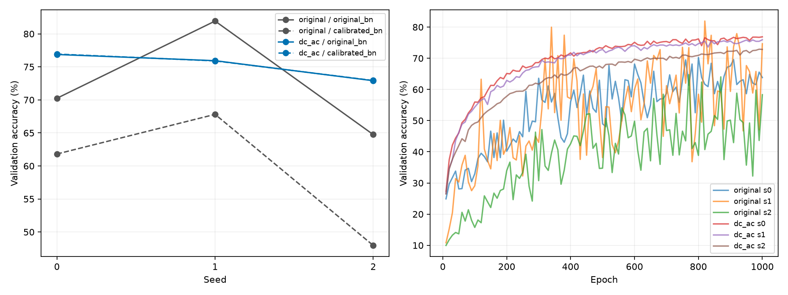

# E2：保留DC的尺度分离实验结果

2026-10-04核对。三个1000轮训练、三个固定权重BN干预、六次独立CUDA核验及四格汇总均完成，控制器12个步骤全部exit 0。运行于2026-10-03 16:18:35北京时间启动，约23:53:49结束，总耗时27313.86秒；该时间包含训练、推理、干预与核验。

## 实验目的与控制条件

研究问题是：涡流I/Q信号中的样本基线DC与较小的变化分量AC尺度悬殊；在保留DC信息的条件下，分别用训练集尺度处理两者，能否改善分组隔离的分类表现和训练稳定性？这是输入尺度单因素对照，不是新增网络或直接深度回归。

在完整250点原单位信号上计算每条波形的DC均值d和AC分量a=x-d。只在全部24000条clean train拟合DC均值、DC总体标准差及AC均方根，随后采用：

`z = ((d - mu_d) / sigma_d + a / sigma_a) / sqrt(2)`。

先完整变换，再转float32、裁剪224点。两个通道sigma_d/sigma_a分别约54.32、60.65；这是训练集的尺度诊断，不是类别语义证据。没有删除DC，也没有逐样本归一化AC幅度。

新旧方法均采用公开结构重建的ResNeXt1D-38、同seed初始化、相同样本顺序/身份裁剪、Adam、batch128、初始lr4e-5、1000epoch。每10轮用固定随机10-crop评价validation，按最高Accuracy及较早epoch选权重。原5000/7500学习率里程碑未压缩到1000轮。训练不使用validation拟合统计或附加噪声，不再次计算test分类。

## 主比较：原BN，clean validation

| seed | 原输入Accuracy | DC/AC输入Accuracy | 配对差（百分点） | 原/新选中epoch |
|---|---:|---:|---:|---:|
| 0 | 70.2500% | 76.8750% | +6.6250 | 800 / 1000 |
| 1 | 81.9375% | 75.9375% | -6.0000 | 820 / 1000 |
| 2 | 64.7500% | 72.9063% | +8.1563 | 770 / 990 |
| 三seed均值 | 72.3125% | 75.2396% | +2.9271 | — |

Accuracy的跨训练seed样本SD由8.7774降至2.0744个百分点；最差seed由64.7500%升至72.9063%。Macro-F1均值由0.723609升至0.751989。

当前证据支持“有限预算下平均性能略升、种子间波动减小”。只有三个配对seed，不能称统计显著，也不说明每次训练或最佳单次成绩都提升：原seed1的81.9375%仍高于三个新模型。保留该下降结果，不选择性删seed。

选中模型的train评价Accuracy均值由61.7361%升至96.4542%，新seed分别为97.3833%、96.4208%、95.5583%。原train大组1/2均值50.7583%/51.5708%，新输入95.9625%/96.8083%；其他train组也提升。这里是固定选中权重的评价模式结果，不能与在线训练Accuracy混用或据此确定原问题的机制。

validation两个组的三seed均值分别为：group3，72.2917%→76.2500%；group11，72.3333%→74.2292%。组指公开数据的波形连接组，不宣称已证明实际跨人员/采集来源泛化。

## 四格BN对照

| 输入 | BN | validation Accuracy均值 | 样本SD（百分点） | Macro-F1均值 |
|---|---|---:|---:|---:|
| 原输入 | 原运行统计 | 72.3125% | 8.7774 | 0.723609 |
| 原输入 | 全train重校准 | 59.1979% | 10.1770 | 0.591262 |
| DC/AC输入 | 原运行统计 | 75.2396% | 2.0744 | 0.751989 |
| DC/AC输入 | 全train重校准 | 75.2604% | 2.0767 | 0.752382 |

BN干预只重算选中权重的运行统计，参数不变，不重新训练或选择epoch。新输入下重校准仅+0.0208个百分点，三个seed也并非全部提升；没有实质收益证据，因此仍以原BN为主要候选。原输入下的明显下降保留为负结果。结果提示输入尺度与BN干预行为有关，尚不能证明BN是原性能波动的唯一原因。

## 学习曲线及剩余问题

新输入的验证曲线比旧输入平稳；固定首末窗口数据见histories.csv，未改分析窗口。新选中轮为1000/1000/990，接近预算上限，不能据此认为已经收敛。train约96.45%而validation约75.24%，仍有较大的泛化差距。应先检查完整原预算下该差距和配对收益是否持续，再追加网络/正则化变化。

在相同grouped_v1划分下，SVM validation Accuracy为60.9063%；新模型均值高14.3333个百分点。SVM本身也是机器学习，这不构成AI相对非AI的对照。原方法重建超过早期简化CNN/ResNet，不把“修正复现方法”当作新算法贡献。

## 验收与复查入口

- [控制器状态](../results/experiments/paper_dc_ac_v1/execution_status.json)：三seed各1000轮、训练/核验/BN/BN核验共12步完成。
- [冻结registry](../results/experiments/paper_dc_ac_v1/registry.json)：SHA256 `29cad377ee788a99ec7f57791eadbfd0380fbd94200363f6edfe950b04fd842f`；22项源码、配置、统计与原证据均未改写。
- [四格汇总](../results/experiments/paper_dc_ac_v1/analysis_results_v1/summary.json)及同目录metrics.csv、groups.csv、per_class.csv、histories.csv、validation_curves.csv。
- [六份CUDA证明](../results/experiments/paper_dc_ac_v1/verification/)：三个新模型和三个BN权重共163200条目标预测逐条重载核验，全部指标误差0；BN缓冲重放误差0。
- [独立结果审计](../results/experiments/paper_dc_ac_v1/results_acceptance_v1/audit.json)：另行从新旧12个单元的CSV复算326400行，核对24条整体、108条组别、480条类别指标及四格统计/历史曲线；最大浮点计算差4.44e-16。核对六份已有CUDA证明、冻结文件、7项汇总输出SHA与12份gzip还原SHA，不执行新训练/推理/test评价。
- [审计脚本](../results/experiments/paper_dc_ac_v1/results_acceptance_v1/audit_results.py)：依赖标准库，项目根目录执行。输出audit.json用排他创建；复查时将脚本复制到本实验下的同层新目录（例如results_acceptance_v2），运行副本，原脚本与audit.json保留，禁止覆盖原证据。

上一轮实现验收400项真实GPU回归通过，无跳过；本轮只新增只读结果审计和文档，没有更改冻结训练源码，也没有重新宣称执行全回归。

## 复现边界与下一阶段

已实现论文核心算法流程：I/Q预处理、训练集标准化、224随机裁剪、ResNeXt1D-38、Adam、10-crop概率平均、验证选择权重。尚未完成原10000轮与5000/7500学习率衰减，也未复现全部11个网络或原检测设备/采集实验。

提供的公开train/test存在精确重复，本项目保持去重整组隔离24000/3200/4800划分，与论文名义38400/4800/4800不同；无法核实作者实际训练去重处理。当前validation与原文test93.58%不构成同条件直接比较。原文部分实现细节未给出、38层参数表与公开结构计数不一致；现重建假设和134654参数见[组件重建](paper_model_reconstruction.md)。即使完成10000轮，也只能称在本项目划分下按公开描述重建。

类别索引到深度/特殊类别的映射仍无直接证据，不能计算毫米误差或±0.1mm指标。后续新研究仍属探索性：formal_v1的test已见，不用已见test挑模型。

下一工作顺序见[完整预算与后续候选](plans/2026-10-04-e2-followup.md)：优先原输入与DC/AC输入同10000轮、三个配对seed；之后固定噪声对照，最后按诊断挑一项结构/增强改动。本次结果核对未启动新的训练。
