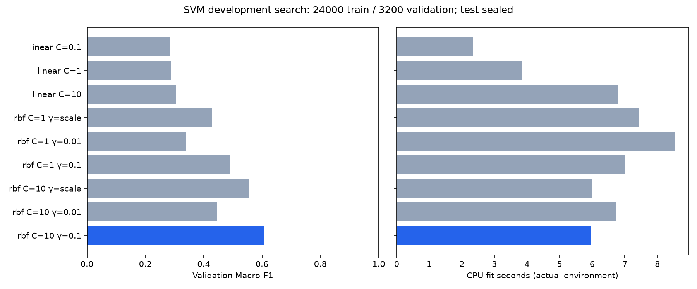
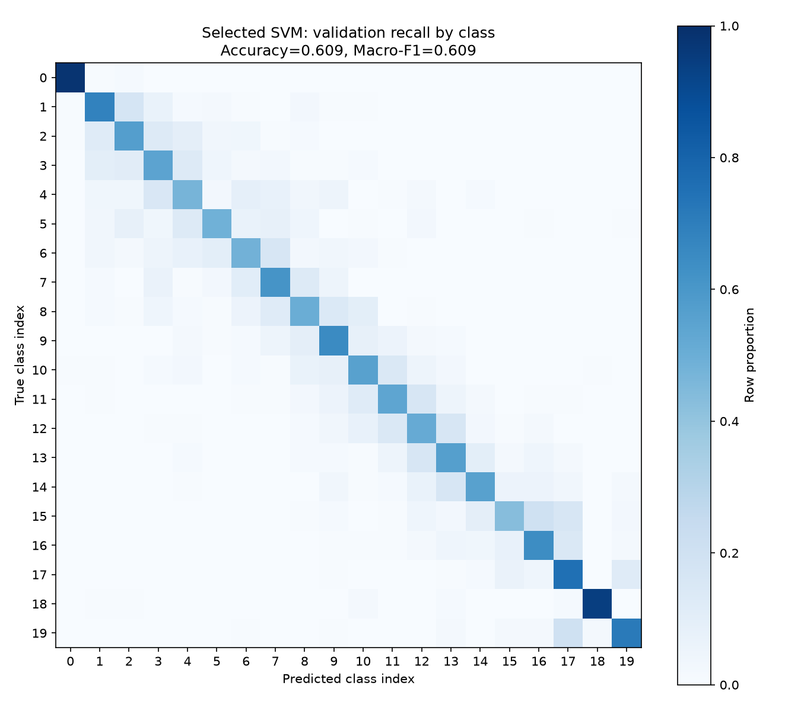

# SVM开发验证实测结果

日期：2026-10-01。grouped_v1固定划分；最终测试分类指标未计算。

## 运行概览

| 运行 | 训练/验证样本 | 被选配置 | 验证Accuracy | 验证Macro-F1 | 整条流程CPU耗时 |
|---|---|---|---:|---:|---:|
| pilot | 2000/3200 | rbf, C=10, gamma=0.1 | 0.375625 | 0.375229 | 3.83秒 |
| full | 24000/3200 | rbf, C=10, gamma=0.1 | 0.609062 | 0.608643 | 73.00秒 |

九个候选均收敛且无警告；默认单CPU线程。耗时是当前WSL2执行环境实测，包含输入校验、特征、搜索、验证预测及重载，不是单模型fit耗时，也不预测其他机器速度。pilot每类100条，full每类1200条；训练规模不同，仅用于链路和预算开发验证。

## 全量九项搜索

| 候选索引 | 分类器 | C | gamma | 验证Accuracy | 验证Macro-F1 | fit秒 | 验证predict秒 |
|---:|---|---:|---|---:|---:|---:|---:|
| 0 | linear | 0.1 | — | 0.312500 | 0.282914 | 2.334 | 0.001 |
| 1 | linear | 1 | — | 0.317500 | 0.289102 | 3.854 | 0.001 |
| 2 | linear | 10 | — | 0.330313 | 0.304347 | 6.798 | 0.001 |
| 3 | rbf | 1 | scale | 0.432188 | 0.429269 | 7.442 | 2.440 |
| 4 | rbf | 1 | 0.01 | 0.344062 | 0.339610 | 8.522 | 2.474 |
| 5 | rbf | 1 | 0.1 | 0.491563 | 0.492305 | 7.020 | 2.433 |
| 6 | rbf | 10 | scale | 0.555625 | 0.554415 | 5.994 | 2.359 |
| 7 | rbf | 10 | 0.01 | 0.446250 | 0.444743 | 6.726 | 2.387 |
| 8 | rbf | 10 | 0.1 | 0.609062 | 0.608643 | 5.945 | 2.345 |

采用预先固定的Macro-F1、Accuracy、较早候选顺序选优，选中索引8。没有依据本轮得分增加网格或特征。非线性候选在这份验证集表现较好；LinearSVC与RBF SVC的损失/多分类策略也不同，因此不作纯核函数或残差结构的因果结论。

## 验证组

| group_id | 样本数 | Accuracy | Macro-F1 |
|---:|---:|---:|---:|
| 3 | 1600 | 0.618125 | 0.617135 |
| 11 | 1600 | 0.600000 | 0.600031 |

group_id来自冻结人员连接分量，不等同于已核实的独立试件/来源。混淆矩阵显示部分邻近索引易混淆，但索引语义未确认，不能据此计算相邻深度容差。

## 追溯与验证

- [完整全量运行报告](../results/baselines/svm_full_v1/report.json)记录各候选20类指标、混淆矩阵、依赖/配置/缓存/输入/代码SHA；[pilot报告](../results/baselines/svm_pilot_v1/report.json)独立保留。
- 每条验证预测及训练索引保存在对应run目录。两次运行加载模型的预测与CSV逐条一致，标签与冻结清单一致；在/tmp下验收当前代码/缓存/图片SHA绑定。
- 全项目59项测试通过；近重复/SVM独立审查及修复见[审查记录](code_review.md)。模型joblib不入Git，clone后按[运行协议](svm_baseline.md)重跑生成。
- 固定train/validation近重复两指标阈值内候选0；只覆盖定义的变换，不能证明实际采集来源独立。测试侧数据诊断尚待完成，测试分类仍封存。
- 不与原论文准确率直接作同协议比较，不计算未确认标签对应的毫米误差或具名特殊类指标。下一步为CNN/ResNet与噪声函数，正式实验另行冻结。
